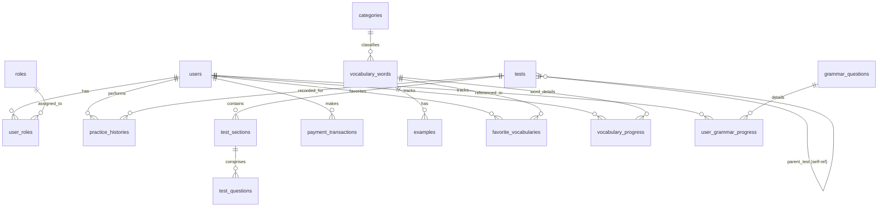

# Entity Architecture & Data Model Plan

This document provides a detailed breakdown of the entity data model for the Prepme IELTS preparation platform. It categorizes the entities into logical modules, outlines their fields, and maps their relationships.

---

## Entity Relationship Overview

The following diagram illustrates how users, roles, exams, vocabulary, grammar progress, and payment transactions relate to each other:

---

## 1. Base Structure

### [BaseEntity.java](file:///d:/prepme/project-website_prepme/BE/WEBSITE_PREPME/src/main/java/com/fpt/website_prepme/model/entity/BaseEntity.java)
An abstract mapped superclass containing default audits and identifiers inherited by all other database entities.
- **`id`** (Long, Primary Key): Autoincremented identifier.
- **`createdAt`** (LocalDateTime): Insertion timestamp.
- **`updatedAt`** (LocalDateTime): Last modified timestamp.
- **`createdBy`** (String): Username of the creator.
- **`updatedBy`** (String): Username of the last updater.
- **`isDeleted`** (Boolean): Soft delete state flag.

---

## 2. Authentication & User Management

### [UserEntity.java](file:///d:/prepme/project-website_prepme/BE/WEBSITE_PREPME/src/main/java/com/fpt/website_prepme/model/entity/UserEntity.java)
Manages user accounts, targets, profile settings, and membership tier details.
- **`username`** (String, Unique): Access login name.
- **`email`** (String): Electronic mail address.
- **`password`** (String): Hashed credential pass.
- **`fullName`** (String): Display name.
- **`avatarUrl`** (String): Profile picture link.
- **`phone`** (String, Unique): Mobile phone contact.
- **`provider`** (AuthProvider): Login authentication type (`LOCAL`, `GOOGLE`).
- **`membershipType`** (MembershipType): Account status tier (`FREE`, `PREMIUM`).
- **`subscriptionExpiresAt`** (LocalDateTime): Premium expiration.
- **`roles`** (Set\<RoleEntity\>): Associated security permissions.

### [RoleEntity.java](file:///d:/prepme/project-website_prepme/BE/WEBSITE_PREPME/src/main/java/com/fpt/website_prepme/model/entity/RoleEntity.java)
Roles representing authority levels.
- **`name`** (String): Security role identifier (e.g. `ROLE_USER`, `ROLE_ADMIN`).

---

## 3. Exam Practice (IELTS)

### [TestEntity.java](file:///d:/prepme/project-website_prepme/BE/WEBSITE_PREPME/src/main/java/com/fpt/website_prepme/model/entity/TestEntity.java)
Defines a specific IELTS or skills practice test.
- **`title`** (String): Exam headline.
- **`examType`** (ExamType): Skill designation (`LISTENING`, `READING`, `WRITING`, `SPEAKING`, `IELTS`).
- **`duration`** (Integer): Maximum timer duration in seconds.
- **`audioUrl`** (String): Main listening track link.
- **`description`** (String): Brief summary.
- **`isPro`** (Boolean): Premium access gatekeeper flag.
- **`parentTest`** (TestEntity): Self-reference to join subtests under composite IELTS Packages.
- **`sections`** (List\<TestSectionEntity\>): Nested exam portions.

### [TestSectionEntity.java](file:///d:/prepme/project-website_prepme/BE/WEBSITE_PREPME/src/main/java/com/fpt/website_prepme/model/entity/TestSectionEntity.java)
Defines paragraphs, audio files, or speaking topics belonging to a test section.
- **`test`** (TestEntity): Owner exam.
- **`sectionNumber`** (Integer): Ordering position (e.g., Part 1, Part 2).
- **`title`** (String): Description tag.
- **`passage`** (String): Text context (useful for Reading & Writing).
- **`cueCard`** (String): Speaking card details.
- **`audioUrl`** (String): Audio tracks unique to the section.

### [TestQuestionEntity.java](file:///d:/prepme/project-website_prepme/BE/WEBSITE_PREPME/src/main/java/com/fpt/website_prepme/model/entity/TestQuestionEntity.java)
Contains individual questions that users answer during a test section.
- **`section`** (TestSectionEntity): Outer section container.
- **`questionNumber`** (Integer): Ordered identifier inside the exam.
- **`questionType`** (QuestionType): Format type (`MULTIPLE_CHOICE`, `FILL_IN_THE_BLANK`, etc.).
- **`questionText`** (String): The question content.
- **`options`** (String - JSON): Multiple-choice choices.
- **`correctAnswer`** (String): Validation target answer.
- **`explanation`** (String): Guided explanation.

---

## 4. History & Performance Analysis

### [PracticeHistoryEntity.java](file:///d:/prepme/project-website_prepme/BE/WEBSITE_PREPME/src/main/java/com/fpt/website_prepme/model/entity/PracticeHistoryEntity.java)
Stores history, scores, and AI evaluations when users complete/draft an exam.
- **`user`** (UserEntity): Associated student.
- **`test`** (TestEntity): Attempted exam.
- **`skillType`** (SkillType): Categorized skill (`LISTENING`, `READING`, `WRITING`, `SPEAKING`).
- **`score`** (Double): Auto-graded or AI-graded mark.
- **`completionTime`** (Integer): Elapsed duration.
- **`answers`** (String - JSON): Student responses.
- **`submissionContent`** (String): Freeform writing essays or speaking transcripts.
- **`recordingUrl`** (String): User speech audio link.
- **`aiAnalysis`** (String): Rich AI feedback, grammar checking, corrections, and model recommendations.
- **`status`** (PracticeStatus): Workflow status (`DRAFT`, `SUBMITTED`, `EVALUATING`, `COMPLETED`).

---

## 5. Vocabulary Module

### [VocabularyWordEntity.java](file:///d:/prepme/project-website_prepme/BE/WEBSITE_PREPME/src/main/java/com/fpt/website_prepme/model/entity/VocabularyWordEntity.java)
Defines dictionary items in the learning database.
- **`word`** (String): Target term.
- **`ipa`** (String): International Phonetic Alphabet representation.
- **`meaning`** (String): Core definition.
- **`translation`** (String): Native language definition.
- **`partOfSpeech`** (String): Word type classification (noun, verb, etc.).
- **`category`** (CategoryEntity): Target vocabulary group.

### [CategoryEntity.java](file:///d:/prepme/project-website_prepme/BE/WEBSITE_PREPME/src/main/java/com/fpt/website_prepme/model/entity/CategoryEntity.java)
Classifies vocabulary terms or grammar rules into coherent themes (e.g. "Work", "Environment").
- **`name`** (String): Topic label.
- **`description`** (String): Detail description.

### [ExampleEntity.java](file:///d:/prepme/project-website_prepme/BE/WEBSITE_PREPME/src/main/java/com/fpt/website_prepme/model/entity/ExampleEntity.java)
Contextual sentences showing words in action.
- **`word`** (VocabularyWordEntity): Target dictionary term.
- **`sentence`** (String): Source sentence.
- **`translation`** (String): Translated sentence.

### [FavoriteVocabularyEntity.java](file:///d:/prepme/project-website_prepme/BE/WEBSITE_PREPME/src/main/java/com/fpt/website_prepme/model/entity/FavoriteVocabularyEntity.java)
Tracks bookmarked vocabulary words favorited by specific users.
- **`user`** (UserEntity): Bookmarking student.
- **`word`** (VocabularyWordEntity): Favorited item.

### [VocabularyProgressEntity.java](file:///d:/prepme/project-website_prepme/BE/WEBSITE_PREPME/src/main/java/com/fpt/website_prepme/model/entity/VocabularyProgressEntity.java)
Tracks user familiarity and retention progress with specific words.
- **`user`** (UserEntity): Target student.
- **`word`** (VocabularyWordEntity): Tracked word.
- **`isLearned`** (Boolean): Mastered checkbox flag.
- **`reviewCount`** (Integer): Total flashcard review attempts.

---

## 6. Grammar Module

### [GrammarQuestionEntity.java](file:///d:/prepme/project-website_prepme/BE/WEBSITE_PREPME/src/main/java/com/fpt/website_prepme/model/entity/GrammarQuestionEntity.java)
Contains grammar-focused multiple-choice tests.
- **`questionText`** (String): Question body.
- **`options`** (String - JSON): Choice array.
- **`correctAnswer`** (String): Key answer.
- **`explanation`** (String): Guided explanation.
- **`category`** (CategoryEntity): Target grammar rule context.

### [UserGrammarProgressEntity.java](file:///d:/prepme/project-website_prepme/BE/WEBSITE_PREPME/src/main/java/com/fpt/website_prepme/model/entity/UserGrammarProgressEntity.java)
Logs user response outcomes for grammar practice.
- **`user`** (UserEntity): Associated student.
- **`question`** (GrammarQuestionEntity): Evaluated question.
- **`isCorrect`** (Boolean): Assessment status flag.

---

## 7. Payments & Files

### [PaymentTransactionEntity.java](file:///d:/prepme/project-website_prepme/BE/WEBSITE_PREPME/src/main/java/com/fpt/website_prepme/model/entity/PaymentTransactionEntity.java)
Logs transactions and payment status for PRO upgrades.
- **`user`** (UserEntity): Purchasing student.
- **`transactionRef`** (String): Payment reference key.
- **`amount`** (Double): Price amount paid.
- **`status`** (String): State (e.g. `SUCCESS`, `PENDING`).
- **`paymentGateway`** (String): Gate platform (e.g., Stripe, VNPay).

### [FileEntity.java](file:///d:/prepme/project-website_prepme/BE/WEBSITE_PREPME/src/main/java/com/fpt/website_prepme/model/entity/FileEntity.java)
Stores configuration details and storage locations for user-uploaded assets.
- **`fileName`** (String): Safe title.
- **`fileUrl`** (String): Download link.
- **`fileType`** (String): Mime category.
- **`fileSize`** (Long): Size in bytes.
